## Задание A1: "Собери и запусти" (Docker, Linux, CLI)

1. Создал виртуальную машину с помощью vagrant, сразу с директорией test-project.
   
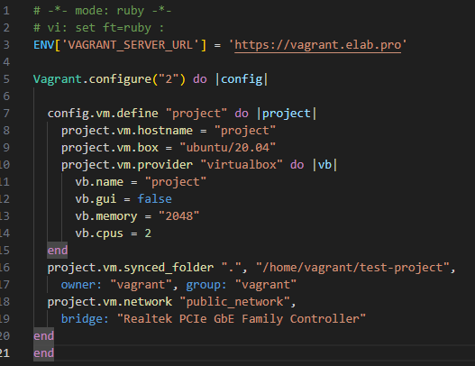

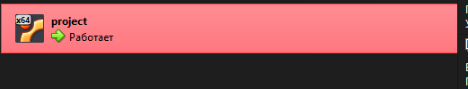

- Подключился к машине

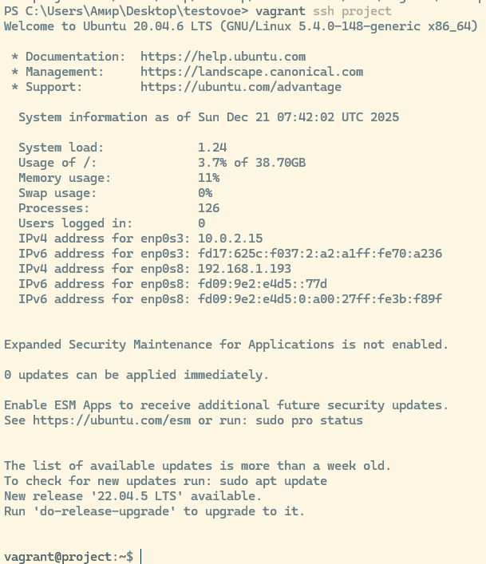

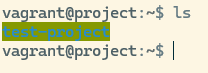

- Обновил

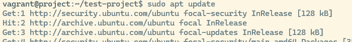

- Установил docker и docker-compose

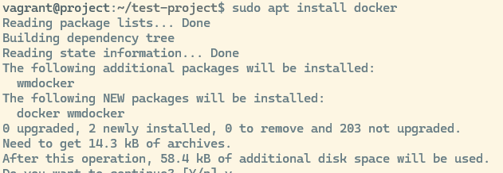

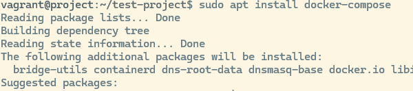

2. Создал и написал новый index.html

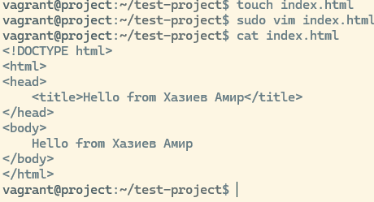

- Написал Dockerfile

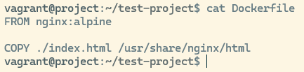

3. Собрал контейнер с тегов my-web-app:latest

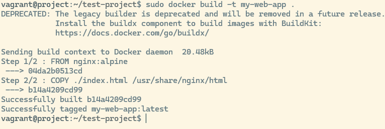

4. Запустил контейнер с маппингом портов 8080:80 

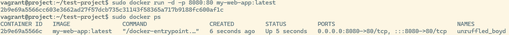

- Проверил внутри контейнера появился ли файл index.html

5. Проверил подключение к nginx в виртуальной машине 

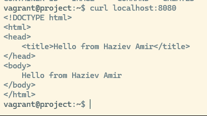

- Проверил подключение к nginx в браузере

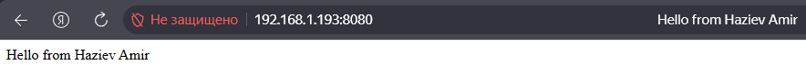

6. Написал простой docker-compose 

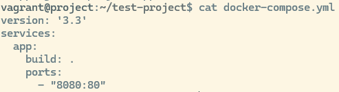

- Запустил docker-compose

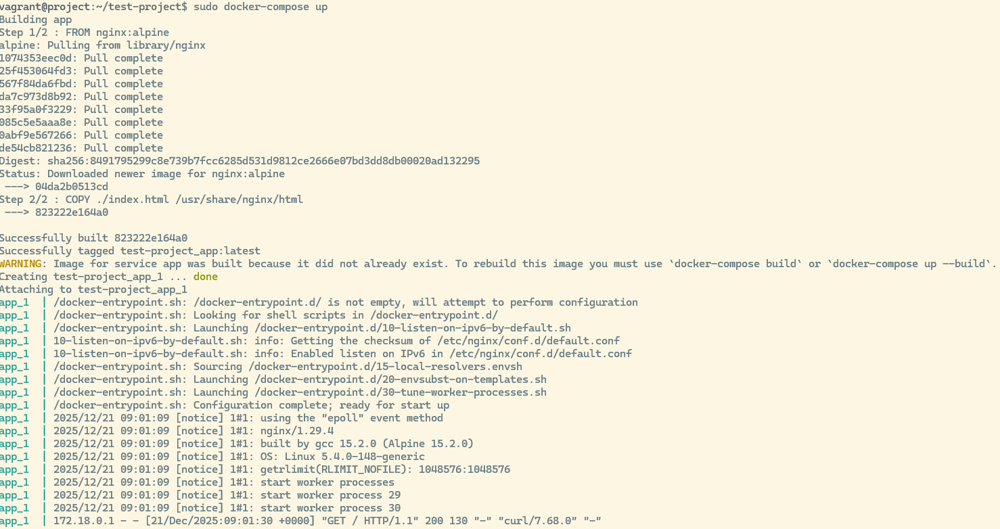

- Проверил отдается ли страница

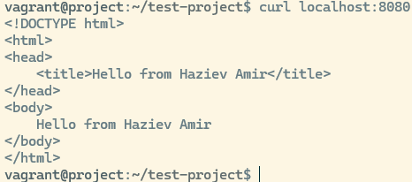

7. Как можно доставить твой index.html в контейнер, не пересобирая образ?
    *Ответ: Можно подключить папку внутри контейнера с хостовой папкой, так чтобы не пересобирать заново образ.*

## Задание B1: "Простой скрипт-помощник" (Bash)

1. Создал файл с именем *clean_old_logs.sh*   

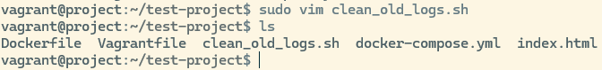

- Написал bash-скрипт clean_old_logs.sh, который 
	- Принимает два аргумента: путь к директории (/path/to/logs) и количество дней (N).
	- Находит в указанной директории все файлы с расширением .log, которые старше N дней. 
	- Выводит список этих файлов на экран и запрашивает подтверждение: "Удалить эти файлы? (y/n)". При подтверждении 'y' — удаляет их. При 'n' — завершает работу. 
	- Если аргументы не переданы, выводит справку по использованию скрипта.

## Задание B2: "Маленькая проблема в Git" (Git)

Ситуация:
1. Ты сделал коммиты в ветке *feature/junior-task*.
2. Тебе нужно срочно переключиться на main, чтобы поправить баг, но твои текущие изменения не готовы для коммита.
3. Как сохранить твою незакоммиченную работу, переключиться на main, а потом вернуться к ней?
4. После возврата в feature/junior-task ты понял, что последний коммит нужно переименовать. Как это сделать?

Задача: Напиши последовательность команд Git для решения этой ситуации.

1. Сохраняем изменения без коммита - *git stash*
2. Переключаемся на main - *git checkout main* 
3. Исправляем баг
4. Возвращаемся в незакоммиченную работу - *git checkout feature/junior-task*
5. Восстанавливаем сохраненные изменения - *git stash pop*
6. Переименовываем последний коммит - *git commit --amend -m "переименовл последний коммит"*

## Задание B3: "Объясни концепцию" (Понимание CI/CD)

1. Разработчик делает push в ветку *main*
2. Запускается папйлайн по клонированию репозитория, установке всех зависимостей
3. Запускается этап юнит тестов, интеграционных тестов: если тесты успешные - идем дальше; если провалены - прерываемся, отправляется уведомление о неудаче
4. Выполняется сборка образа
5. Выполняется пуш образа в Docker hub. 
	- Если пуш успешен - переход к уведомлению об успехе.
	- Если пуш не удался - пайплайн прерывается, отправляется уведомление о ошибке.

Без данной автоматизации пришлось бы в ручную проверять, собирать и загружать образы в Docker hub, а так же оправлять уведомление об успехе или провале